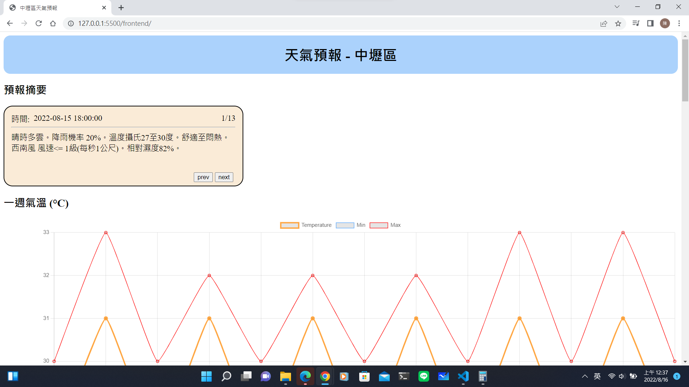
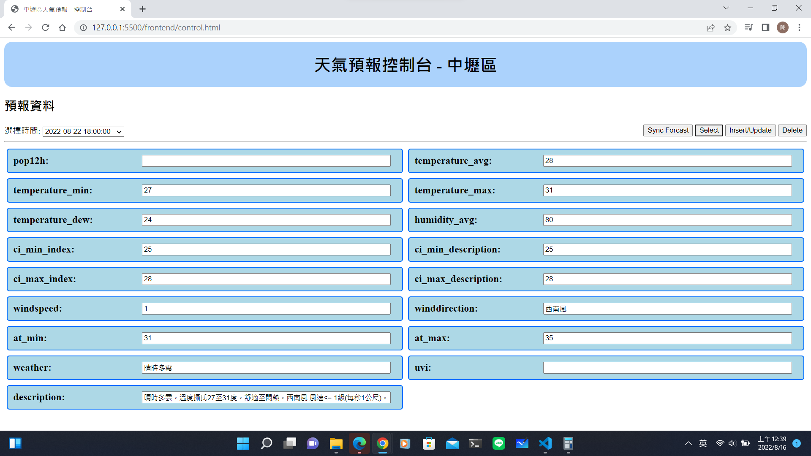

# web_fullstack_learn
homework for ideasky

---
## Infomation
 + backend
    - FastAPI
    - Proxy: uvicorn
    - database: sqlite3
    - no ORM
    - port: 8000
 + frontend
    - pure HTML, CSS, JS
    - char.js
    - page:
        1. index.html
        2. control.html
            * select data by valid datetime
            * insert a new data
            * update data
            * delete data
            * sync forcast data

index.html


control.html


## Usage

1. install python lib

```bash
cd ~/backend/
pip install -r requirements.txt
```

2. Run backend server

```bash
cd ~/backend/
./RunServer.sh
```

3. deploy frontend
 - vscode live server
 - nginx
 - apache
 - IIS
 - others


---
### dataset description

| Parameter                     | Data Type | Description                           |
|-------------------------------|-----------|---------------------------------------|
| id                            | int       | Data id                               |
| datetimelst                   | text      | Datetime of local time                |
| pop12h                        | int       | Probaility of precipitation in 12 hr  |
| temperature_avg               | int       | Average of temperature                |
| temperature_min               | int       | Minimum of temperature                |
| temperature_max               | int       | Maximum of temperature                |
| temperature_dew               | int       | Dew point temperature                 |
| humidity_avg                  | int       | Average of temperature                |
| ci_min_index                  | int       | Minimum of comfortable index          |
| ci_min_description            | text      | Minimum of comfortable description    |
| ci_max_index                  | int       | Maximum of comfortable index          |
| ci_max_description            | text      | Maximum of comfortable description    |
| windspeed                     | int       | Average of wind speed                 |
| winddirection                 | text      | Average of wind direction             |
| at_min                        | int       | Minimum of body temperature           |
| at_max                        | int       | Maximum of body temperature           |
| weather                       | text      | Weather description                   |
| uvi                           | int       | UVI value                             |
| description                   | text      | Summery of weather                    |

```python
ParameterMap = dict(
    PoP12h = "pop12h",
    T = "temperature_avg",
    RH = "humidity_avg",
    MinCI_index = "ci_min_index",
    MinCI_description = "ci_min_description",
    WS = "windspeed",
    MaxAT = "at_max",
    Wx = "weather",
    MaxCI_index = "ci_max_index",
    MaxCI_description = "ci_max_description",
    MinT = "temperature_min",
    UVI = "uvi",
    WeatherDescription = "description",
    MinAT = "at_min",
    MaxT = "temperature_max",
    WD = "winddirection",
    Td = "temperature_dew",
)
```