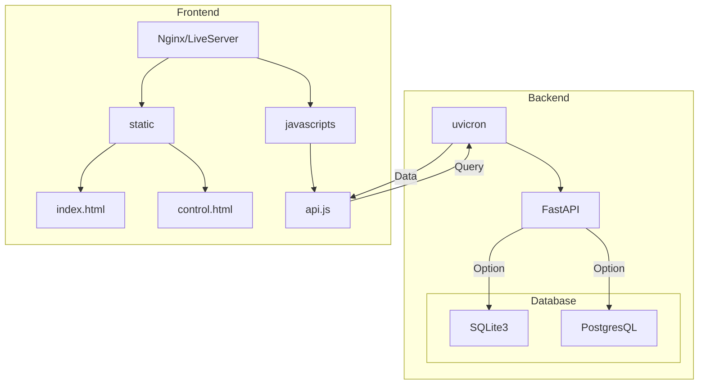

# System Design

```mermaid
graph TD;
subgraph Backend
    subgraph Database
        SQLite3
        PostgresQL
    end
    
    CGI --> backend_server
    backend_server --Option--> SQLite3
    backend_server --Option--> PostgresQL
end

subgraph Frontend
    webserver --> static
    static --> index.html
    static --> control.html
    
    webserver --> javascripts
    javascripts --> api.js
end

api.js --Query--> CGI
CGI --Data--> api.js


webserver[Nginx/LiveServer]
CGI[uvicron]
backend_server[FastAPI]
```